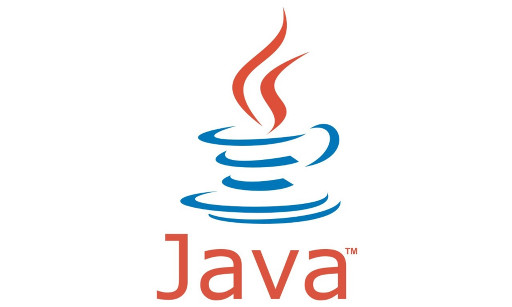

# Java ile Veritabanı Programlama
Eğitmen : Mehmet Emin Tenekeci, etenekeci@harran.edu.tr

# Programın Açıklaması
Bu programın amacı nesneye dayalı programlama kavramlarını tanıtarak bunların farklı uygulama alanlarına ait gerçek olayların modellenmesinde veya gerçek sistemler oluşturulmasında kullanılmasını sağlayarak, nesneye yönelik programlamanın genel prensiplerinin öğretilmesidir. Bu eğitim ile Nesne yönelimli programlama dili olarak en yaygın kullanılan Java Programlama dilini öğreneceksiniz. Bununla birlikte veri tabanı modelleme için gereksinim analizi yapılarak gerçek problemler için uygulama geliştirilebilecektir. Bu eğitim ile JAVA ile veri tabanı projeleri geliştirme konusunda iyi bir başlangıç yapacaksınız. Program içeriğinde JAVA temelleri, Veri tabanı temelleri, masaüstü  uygulama geliştirme ve web uygulama geliştirme konularına değinilecektir.

# Eğitim Detayı
- **Java ya temel giriş konuları**
  - Eclipse Kurulumu ve konfigürasyonu
  - JAVA kodlamaya temel giriş
  - Nesne Yönelimli Programlama mantığı
  - Sınıf yapıları ve kullanımı 
  - Git kullanımı
  - Maven Proje yönetim araçlarının kullanımı
- **Veritabanı** 
  - İlişkisel veri tabanı yönetim sistemleri temelleri
  - MSSQL ve MySQL veri tabanı 
  - Gereksinim Analizinden Tabloların çıkarılması.
  - E-R diyagram ve Normal Formlar
  - Veri tabanı temel işlemleri (CRUD)
  - Strored Procedure
  - Index
  - Transaction
- **JDBS Veri Tabanı Araçları ve Kullanımı**
  - JDBC driver ve Apiler
  - JDBC Database bağlantı 
  - JDBC Komut çalıştırma ve bilgi okuma
  - İleri SQL Sorguları çalıştırma
  - Varlık – Yönetici Örüntüsü kullanımı 
- **İki Katmanlı Mimari ve Örnek Uygulama**
  - Java Persistence API’ lerin kullanımı
  - Runtime Objeler ile Veritabanı sorgulama
  - Örnek Masaüstü Kütüphane Uygulaması I
  - Örnek Masaüstü Kütüphane Uygulaması II
  - Örnek Masaüstü Kütüphane Uygulaması III
- **3 Katmanlı Mimari İle Java Web Uygulaması**
  - 3 Katmanlı Mimari Mantığı ve Yapıtaşları
  - Spring Boot Framework Kurulum ve tanıtım
  - Örnek Online Kütüphane Uygulaması I
  - Örnek Online Kütüphane Uygulaması II
  - Örnek Online Kütüphane Uygulaması III
  - Örnek Online Kütüphane Uygulaması IV
- **JUnit Test Kullanımı ve Örnek Fonksiyon Yazma**
- **Java Web Servis Uygulama**
  - Web Servislere Giriş
    - *SOAP*
    - *REST*
  - SOAP Web Servis bileşenleri
  - Örnek Web Servis Projesi Oluşturma
  - Projeye Operasyonlar Ekleme
  - Web Servis Deploy Etme
  - Web Servis Kullanımı
